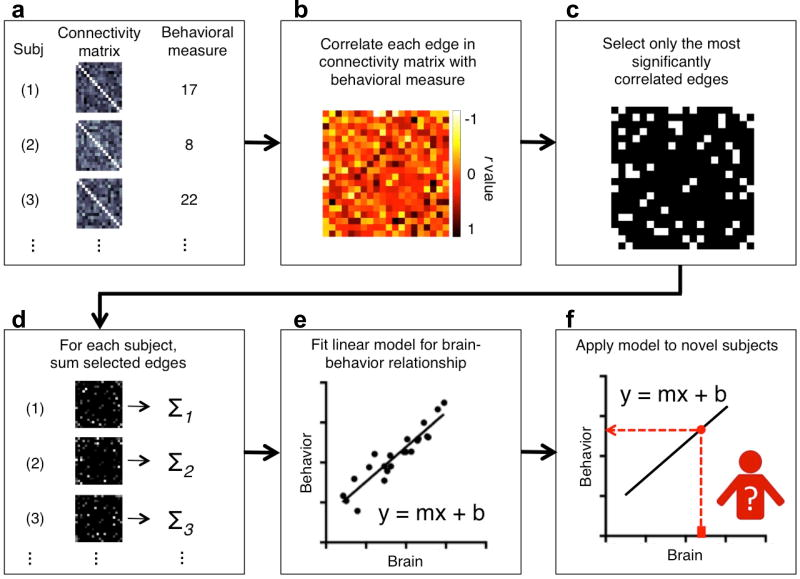

# Connectome-based Predictive Modelling

<div style="text-align:center"></div>


Connectome-based Predictive Modeling (CPM) is a data-driven protocol for developing predictive models of brain-behavior relationships from connectivity data using cross-validation. The protocol includes the following steps: 1) feature selection, 2) feature summarization, 3) model building, and 4) assessment of prediction significance.

In this repository are MATLAB scripts which can be used to carry out CPM. Currently the protocol resembles the methodology in Shen et al. [1]. More features and flexibility will be added in the near future. One can exectute the code via the following:
1. Using the link in the top right corner of this page, download the repository as a zip, and unzip in the desired folder, or clone it to your local computer using the following command: 
```bash
git clone https://github.com/YaleMRRC/CPM.git.
``` 
2. In MATLAB add the path to your script or in your workspace: 
```matlab
addpath('localpath/CPM/matlab/')
```
3. Load in your explanatory data, which can be two or three dimensional (in the case of a series of connectivity matrices), along with the data you wish to model (perhaps a behavioural score).
4. Run the following: 
```matlab
[y_predict, performance] = cpm_main(x,y)
```
   This will run split half cross validation, and use a p threshold of 0.01 to select features. These 
default values can be changed, for example: 
```matlab
[y_predict, performance] = cpm_main(x,y,'pthresh',0.05,'kfolds',10)
```

For further questions please raise an issue [here](https://github.com/YaleMRRC/CPM/issues).

[1] Shen, Xilin, et al. "Using connectome-based predictive modeling to predict individual behavior from brain connectivity." nature protocols 12.3 (2017): 506.